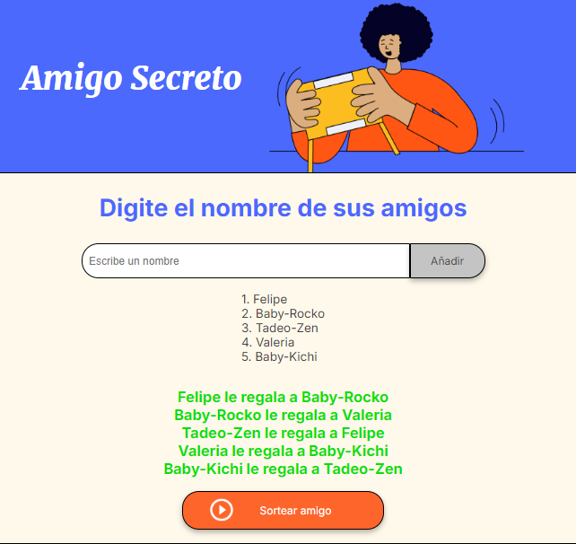

# Alura_challenge_amigo_secreto
AMIGO SECRETO WEB APP
-----------------------------------------------------------------
Descripción
-----------------------------------------------------------------
Amigo Secreto Web App es una aplicación web sencilla y eficaz para organizar el tradicional juego de "Amigo Secreto". Los usuarios pueden registrar participantes, realizar un sorteo aleatorio de amigos secretos y visualizar los resultados en tiempo real. Además, la interfaz es completamente amigable y fácil de usar, permitiendo que todos los usuarios disfruten del juego sin complicaciones.

-----------------------------------------------------------------
Características
-----------------------------------------------------------------
Registro de participantes: Los usuarios pueden ingresar los nombres de los amigos para participar en el sorteo.
Algoritmo de asignación aleatoria: Asigna de forma aleatoria los amigos secretos entre los participantes.
Interfaz dinámica: Visualización de los participantes registrados y los resultados del sorteo en tiempo real.
Exclusiones personalizables: Evita que participantes específicos se asignen entre sí (opcional).
Tecnologías Utilizadas
Frontend: HTML, CSS, JavaScript.
Algoritmo: Lógica de sorteo aleatorio implementada con JavaScript puro.

-----------------------------------------------------------------
Instalación
-----------------------------------------------------------------
Clonar el repositorio:

bash
Copy
Edit
git clone https://github.com/usuario/amigo-secreto.git
Acceder a la carpeta del proyecto:

bash
Copy
Edit
cd amigo-secreto
Instalar dependencias (si es necesario): Si tu proyecto tiene dependencias adicionales, instálalas con:

bash
Copy
Edit
npm install
Ejecutar el servidor (si usas un backend):

bash
Copy
Edit
npm start
Si solo deseas correr el archivo HTML de manera local, solo abre el archivo index.html en tu navegador.

-----------------------------------------------------------------
Uso
-----------------------------------------------------------------
Accede a la aplicación a través del navegador.
En la sección "Digite el nombre de sus amigos", ingresa el nombre de cada participante y presiona el botón "Añadir" para agregarlo a la lista.
Una vez que hayas ingresado todos los amigos, haz clic en "Sortear amigo" para generar el sorteo de amigos secretos.
Los resultados del sorteo se mostrarán en la sección correspondiente, donde podrás ver qué persona le toca regalar a quién.
Disfruta del juego con tus amigos o compañeros.

Ejemplo de Sorteo: 

-----------------------------------------------------------------
Estructura de Archivos
-----------------------------------------------------------------
index.html: Contiene la estructura y diseño de la página.
style.css: Archivos de estilo para personalizar la apariencia de la aplicación.
app.js: Lógica en JavaScript que maneja la interacción con el usuario, incluyendo el registro de amigos y la asignación aleatoria de amigos secretos.

-----------------------------------------------------------------
Resumen de funcionalidades principales:
-----------------------------------------------------------------
Los usuarios pueden agregar sus amigos a una lista.
El sorteo es realizado automáticamente usando un algoritmo de asignación aleatoria implementado en JavaScript.
Los resultados del sorteo son mostrados directamente en la página.
No se requiere de backend ni servicios adicionales para la funcionalidad básica del sorteo.

-----------------------------------------------------------------
Contribuciones
-----------------------------------------------------------------
Las contribuciones son bienvenidas. Si deseas mejorar la aplicación o corregir algún error
